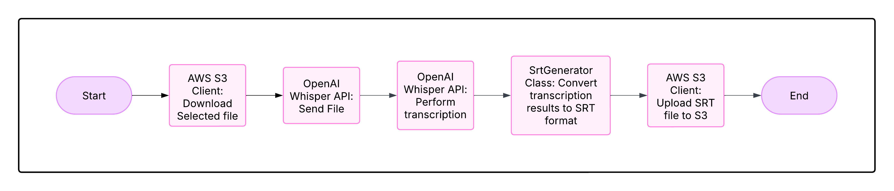

# **AWS Lambda Function for Video Transcription**  

This project is an AWS Lambda function that transcribes videos using OpenAI's Whisper API. The transcription results are generated as an SRT file and uploaded back to an S3 bucket.  

## **Requirements**  
- **AWS Lambda**: Executes the function.  
- **OpenAI Whisper API**: Processes audio transcription.  
- **AWS S3**: Stores and retrieves files.  

## **Supported File Formats**
- MP4 (video/mp4)
- MP3 (audio/mpeg)
- WAV (audio/wav)

## **Setup**  

### **1. Create an AWS Lambda Function**  
- Create a new AWS Lambda function.  
- Upload the `index.mjs` file as the function's source code.  

### **2. Add Required Layers**  
- Include layers for **AWS SDK** and **Axios** from the project files.  

### **3. Configure Memory and Timeout**  
- Increase memory allocation to **2048MB**.  
- Set the timeout limit to **5 minutes**.  

## **Usage**  

The function accepts the following parameters:  

```json
{
  "file_name": "example_video.mp4",
  "user_id": "6790a64b87c2387f93afd485",
  "words_per_line": 3, // max 5
  "punctuation": true,
  "consider_punctuation": true
}
```

## **Parameter Descriptions**  

- **file_name**: The name of the file to be processed.  
- **user_id**: The user ID, used to determine the file path.  
- **words_per_line**: Specifies the number of words per subtitle line.  
- **punctuation**: Determines whether punctuation marks should be included.  
- **consider_punctuation**: Specifies whether punctuation should be considered when generating subtitles.  

## **Example Output**  

The following data represents execution time and memory usage for a 4MB video file:  

```
START RequestId: da692ecb-b3f1-4a92-8c34-ded39595029a Version: $LATEST
2025-03-19T11:37:19.734Z	da692ecb-b3f1-4a92-8c34-ded39595029a	INFO	s3-fetch: 470.787ms
2025-03-19T11:37:22.908Z	da692ecb-b3f1-4a92-8c34-ded39595029a	INFO	whisper-api: 3.173s
2025-03-19T11:37:22.909Z	da692ecb-b3f1-4a92-8c34-ded39595029a	INFO	srt-generation: 0.909ms
2025-03-19T11:37:22.974Z	da692ecb-b3f1-4a92-8c34-ded39595029a	INFO	s3-upload: 65.06ms
2025-03-19T11:37:22.974Z	da692ecb-b3f1-4a92-8c34-ded39595029a	INFO	total-execution: 3.711s
END RequestId: da692ecb-b3f1-4a92-8c34-ded39595029a
REPORT RequestId: da692ecb-b3f1-4a92-8c34-ded39595029a	Duration: 3717.83 ms	Billed Duration: 3718 ms	Memory Size: 2048 MB	Max Memory Used: 144 MB	Init Duration: 853.54 ms	
```

## **Diagram**  

The project's workflow diagram is shown below:  



